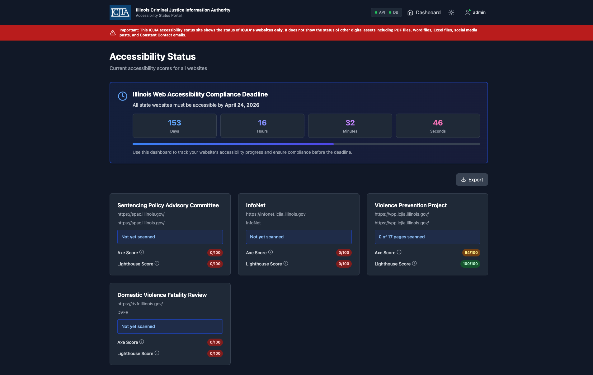

# ICJIA Accessibility Status

> **Last Updated**: November 13, 2025

A comprehensive web accessibility tracking system for the Illinois Criminal Justice Information Authority, designed to monitor progress toward April 2026 compliance goals across all ICJIA web properties.

**Architecture**: React frontend (Vite) + Express backend + Supabase PostgreSQL | **No Docker** | **Yarn-based scripts**

> 📚 **[Documentation](#-documentation)** | **[GitHub Repository](https://github.com/ICJIA/icjia-accessibility-status)**

## 📸 Screenshots



## 📥 Export Data

All users can export accessibility data in multiple formats directly from the dashboard - **no authentication required**:

- **JSON** - Complete structured data for programmatic access
- **CSV** - Spreadsheet-compatible format for analysis in Excel/Sheets
- **Markdown** - Formatted report for documentation and sharing

Click the **Export** button on the dashboard to download your preferred format. Perfect for:

- Compliance reporting
- Stakeholder presentations
- Data analysis and trending
- Integration with other tools

## ⚡ Quick Start

### Prerequisites

- **Node.js 20+** (check with `node --version`)
- **Yarn 1.22.22** (check with `yarn --version`)
- **Supabase account** (free tier works fine)

### Local Development (5 Minutes)

```bash
# 1. Clone and install dependencies
git clone https://github.com/ICJIA/icjia-accessibility-status.git
cd icjia-accessibility-status
yarn install

# 2. Configure environment variables
cp .env.sample .env
# Edit .env and add your Supabase credentials:
#   VITE_SUPABASE_URL=https://your-project-ref.supabase.co
#   VITE_SUPABASE_ANON_KEY=your-anon-key-here
#   FRONTEND_URL=http://localhost:5173
#   VITE_API_URL=http://localhost:3001/api

# 3. Run database migrations (one-time setup)
# Go to Supabase Dashboard → SQL Editor → New query
# Copy and run each migration file in order:
#   supabase/migrations/01_create_initial_schema.sql
#   supabase/migrations/02_add_api_keys_and_payloads.sql
#   supabase/migrations/03_add_scans_and_results.sql
#   supabase/migrations/04_add_scan_violations.sql
#   supabase/migrations/05_final_setup_and_cleanup.sql

# 4. Start development server (frontend + backend)
yarn dev

# 5. Access the application
# Frontend: http://localhost:5173
# Backend API: http://localhost:3001/api
# Admin Panel: http://localhost:5173/admin (default: admin / no password)
```

### Available Yarn Scripts

```bash
# ============================================================================
# DEVELOPMENT
# ============================================================================
yarn dev              # Start frontend (Vite) + backend (Express) concurrently
yarn dev:frontend     # Frontend only - Vite dev server on port 5173
yarn dev:backend      # Backend only - Express server on port 3001
yarn staging          # Staging mode - frontend dev + backend with watch

# ============================================================================
# PRODUCTION BUILD & DEPLOYMENT
# ============================================================================
yarn build            # Build frontend for production (creates dist/ directory)
yarn production:simple # Test production build locally (no PM2)
                      # Runs: vite preview (port 5173) + Express (port 3001)
yarn production:pm2   # Full production deployment with PM2
                      # Runs: yarn install && yarn build && pm2 restart
yarn start            # Start services with PM2 (requires PM2 installed globally)
yarn stop             # Stop all PM2 services
yarn restart          # Restart all PM2 services
yarn logs             # View PM2 logs for backend service
yarn status           # Show PM2 service status

# ============================================================================
# CODE QUALITY & UTILITIES
# ============================================================================
yarn lint             # Run ESLint on all files
yarn typecheck        # Run TypeScript type checking
yarn seed             # Populate database with sample data
yarn reset:users      # Reset all users in database
yarn reset:app        # Reset entire application (users + sites + data)
yarn preview          # Preview production build locally (Vite preview)
```

## 🚀 Production Deployment

### Architecture Overview

```
User Request (port 80/443)
    ↓
Nginx (Reverse Proxy)
    ├─ / → Frontend (static files from dist/)
    └─ /api/* → Backend (port 3001, managed by PM2)
```

**Frontend**: Built to static files (`dist/`) and served by Nginx
**Backend**: Express server on port 3001, managed by PM2
**Database**: Supabase PostgreSQL (cloud-hosted)

### Deployment Options

#### Option 1: Laravel Forge (Recommended)

For detailed Laravel Forge deployment instructions, see **[docs/deployment/laravel-forge.md](docs/deployment/laravel-forge.md)**.

**Quick steps:**

1. Create a new Node.js site in Laravel Forge
2. Set Node.js version to 20+
3. Configure environment variables from `.env.sample`
4. Run database migrations (01-05 in order)
5. Deploy using Git with PM2 process management

**Deployment command:**

```bash
yarn production:pm2  # Build frontend + start backend with PM2
```

#### Option 2: Ubuntu Server with PM2 + Nginx

For detailed instructions, see **[docs/deployment/overview.md](docs/deployment/overview.md)**.

**Quick setup:**

```bash
# 1. Install PM2 globally (one-time)
npm install -g pm2

# 2. Deploy application
git clone https://github.com/ICJIA/icjia-accessibility-status.git
cd icjia-accessibility-status
yarn install
cp .env.sample .env
# Edit .env with production values

# 3. Run database migrations in Supabase

# 4. Start services with PM2
yarn production:pm2

# 5. Setup auto-start on reboot
pm2 startup
pm2 save
```

#### Option 3: Other Cloud Platforms

See **[docs/deployment/overview.md](docs/deployment/overview.md)** for:

- Vercel (frontend only)
- Heroku
- AWS
- DigitalOcean

## 📚 Documentation

All documentation is available as Markdown files in the `/docs` directory, organized by topic for easy navigation.

### 🚀 Getting Started

- **[Quick Start Guide](docs/getting-started/quick-start.md)** - Get up and running in 5 minutes
- **[Setup Guide](docs/getting-started/setup-guide.md)** - Complete setup walkthrough
- **[Development Setup](docs/getting-started/development-setup.md)** - Local development environment
- **[Introduction](docs/getting-started/intro.md)** - Project overview

### 🏗️ Architecture & Core Concepts

- **[System Architecture](docs/architecture/architecture.md)** - System architecture overview
- **[Database Schema](docs/architecture/database-schema.md)** - Database structure and relationships
- **[Authentication System](docs/architecture/authentication.md)** - Authentication system details

### 💻 Development

- **[API Overview](docs/api/overview.md)** - Complete API reference
- **[API Authentication](docs/api/authentication.md)** - API authentication guide
- **[Sites Endpoints](docs/api/sites.md)** - Sites API reference
- **[API Keys Management](docs/api/api-keys.md)** - API keys endpoints
- **[Testing Guide](docs/development/testing.md)** - Testing procedures
- **[Reset Scripts](docs/development/reset-scripts.md)** - Database reset utilities
- **[API Rate Limiting](docs/development/API_RATE_LIMITING_AND_ROTATION.md)** - Rate limiting and key rotation
- **[Setup Documentation](docs/development/SETUP.md)** - Development setup details
- **[Quick Start Summary](docs/development/QUICK_START_SETUP_SUMMARY.md)** - Quick reference

### 🚢 Deployment

- **[Deployment Overview](docs/deployment/overview.md)** - Deployment options and strategies
- **[Laravel Forge Setup](docs/deployment/laravel-forge.md)** - Complete Forge deployment guide
- **[PM2 Configuration](docs/deployment/pm2.md)** - PM2 setup and configuration
- **[Nginx Configuration](docs/deployment/nginx.md)** - Nginx reverse proxy setup
- **[Production Deployment](docs/deployment/production.md)** - Production deployment checklist
- **[Health Check Monitoring](docs/deployment/health-check-monitoring.md)** - Monitoring setup
- **[Database Backups](docs/deployment/database-backups.md)** - Backup procedures

### 🔒 Security & Audits

- **[Security Audit Report](docs/security/SECURITY_AUDIT.md)** - Complete security audit
- **[Security Findings](docs/security/security-findings.md)** - Security issues and fixes
- **[RLS Security Audit](docs/security/RLS_SECURITY_AUDIT.md)** - Row-level security audit
- **[Audit Overview](docs/security/audit-overview.md)** - Security audit overview
- **[Critical Issues Fixed](docs/security/critical-issues-fixed.md)** - Critical security fixes

### 🔧 Troubleshooting

- **[Common Issues](docs/troubleshooting/common-issues.md)** - Common problems and solutions
- **[Authentication Errors](docs/troubleshooting/authentication-errors.md)** - Auth troubleshooting
- **[Database Errors](docs/troubleshooting/database-errors.md)** - Database troubleshooting

### 📋 Project Information

- **[Feature Summary](docs/project/FEATURE_SUMMARY.md)** - Current features overview
- **[Project Roadmap](docs/project/FUTURE_ROADMAP.md)** - Future features and roadmap

## Prerequisites

- **Node.js 20+** (check with `node --version`, specified in `.nvmrc`)
- **Yarn 1.22.22** (check with `yarn --version`, specified in `package.json`)
- **Supabase account** (free tier works fine - https://supabase.com)
- **PM2** (for production deployment: `npm install -g pm2`)

## Tech Stack

### Frontend

- **React 18** - UI framework
- **TypeScript** - Type-safe JavaScript
- **Vite** - Build tool and dev server
- **Tailwind CSS** - Utility-first CSS framework
- **Recharts** - React charting library
- **React Router** - Client-side routing

### Backend

- **Express.js** - Web framework
- **Node.js 20+** - JavaScript runtime
- **TypeScript** - Type-safe JavaScript
- **tsx** - TypeScript executor (no build step needed)

### Database & Authentication

- **Supabase** - PostgreSQL database (cloud-hosted)
- **Row-Level Security (RLS)** - Database-level access control
- **Cookie-based sessions** - Session management
- **bcrypt** - Password hashing

### DevOps & Deployment

- **PM2** - Process manager (production)
- **Nginx** - Reverse proxy (production)
- **Yarn** - Package manager
- **Concurrently** - Run multiple processes

### Development Tools

- **ESLint** - Code linting
- **TypeScript** - Type checking
- **Nodemon** - Auto-restart on file changes
- **Vite** - Hot module replacement (HMR)

## License

This project is licensed under the MIT License - see the [LICENSE](LICENSE) file for details.

---

© 2025 Illinois Criminal Justice Information Authority (ICJIA). All rights reserved.
